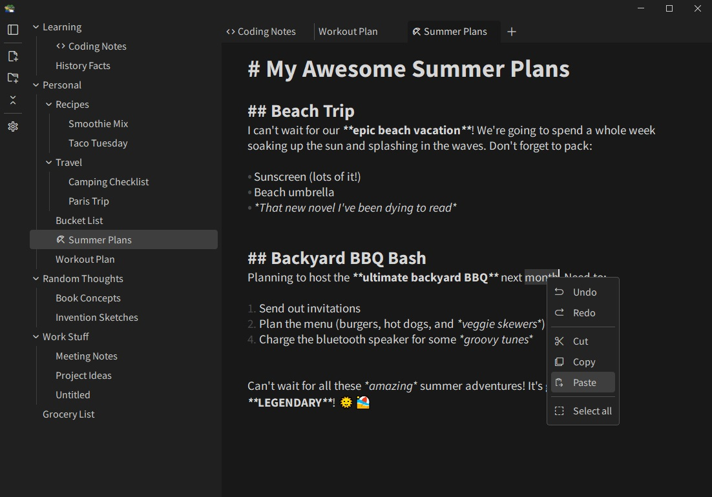

A simple file manager, note organizer and text editor, featuring live [markdown](https://daringfireball.net/projects/markdown) preview


## Key features:
- Tab management
- Customization and theming 
- Image preview
- Find and Replace text


Major Markdown features that are currently not supported:
- Blockquotes
- Code blocks
- Tables
- Task lists


## Build with [Nuitka](https://github.com/Nuitka/Nuitka)
```
nuitka --standalone --disable-console --windows-icon-from-ico=resource/logo.ico --plugin-enable=pyqt6 --include-data-dir=resource=resource --include-data-dir=widget=widget --output-dir=build --output-filename=qnotes main.py
```


## Preview



## Attributions
This project uses a modified version of the [Material Symbols](https://github.com/google/material-design-icons/blob/master/variablefont/MaterialSymbolsOutlined%5BFILL%2CGRAD%2Copsz%2Cwght%5D.ttf) font, created by Google and licensed under the [Apache License 2.0](https://www.apache.org/licenses/LICENSE-2.0).
